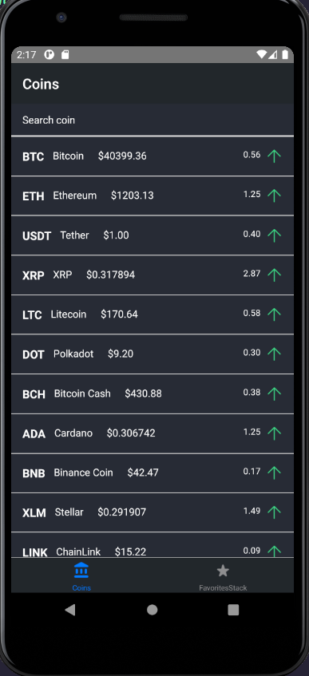
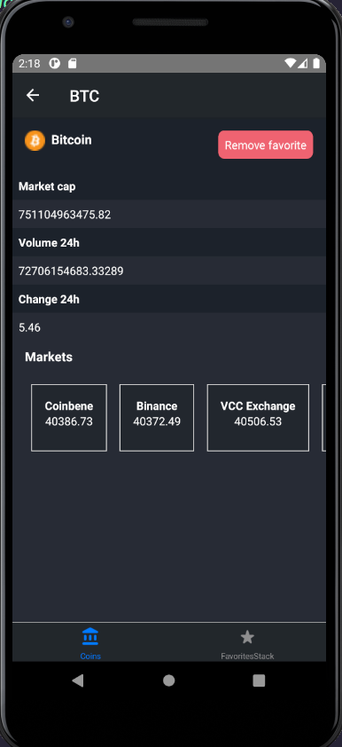
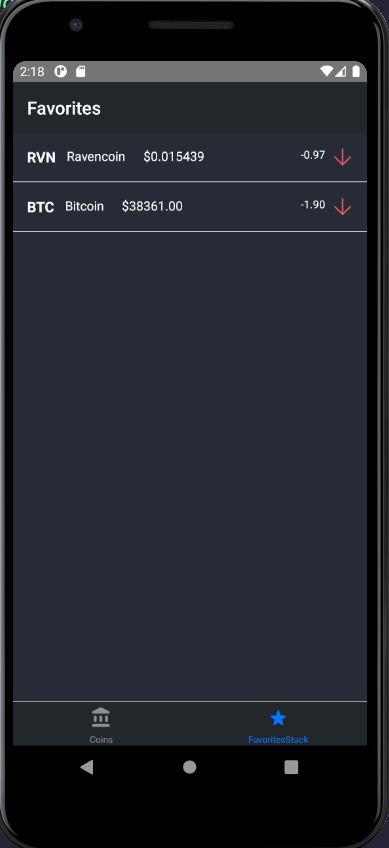

<h1 align="center">
   cryptoTracker App 
</h1>

cryptoTracker App is a mobile app developed in react-native and is a 
multi platform app, you caon use  this in Ios and Android systems 

## Table of Contents
- [Steps to Collaborate](#steps-to-collaborate)
- [Views](#views)
  - [Home](#home)
  - [Home/Detail](#home/detail)
  - [Favorites](#favorite)
- [License](#license)

## Steps to Collaborate

1. Fork the project: by clicking the fork button (located at the top right corner)
2. Clone the project: `git clone https://github.com/<your username>/cryptoTracker`
3. Install dependencies: `npm install` or use `npm i`
4. Run the project: `npx react-native start  && npx react-native android ` 
5. Do the necessary improvements and make a commit: `git commit -am "<commit message>"` or use `git add .` and then `git commit -m "<commit message>"`
6. Upload changes to the repository created with the fork: `git push origin <branch name>`
7. Create a pull request to the original project.

## Views

### Home 

    

### Home/Detail

    

### Favorites

    

## License

[MIT License](https://github.com/Ulzahk/Frontend-Blog/blob/main/LICENSE)